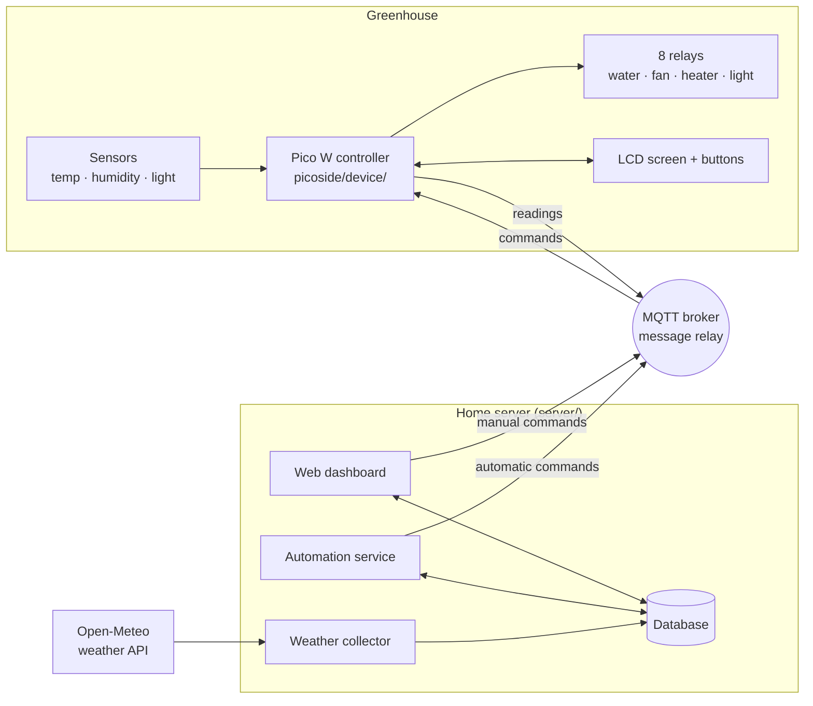

# Greenhouse Control System

A home-built smart greenhouse. A small microcontroller inside the greenhouse measures conditions and
switches equipment. A web dashboard on the home network lets you see what's happening, change the
rules, and switch things by hand.

> **Status (Sept 2026):** the pieces exist, but the connection between them is not finished yet.
> The dashboard shows outdoor weather and lets you edit settings. Live greenhouse readings do not
> reach the dashboard yet, and dashboard commands do not reach the relays yet. See
> [What works today](#what-works-today) and the [improvement plan](docs/PLAN.md).

## What it does

- **Measures** temperature, humidity and light inside the greenhouse every 5 minutes.
- **Controls** a bank of 8 relays. Four are in use: **water**, **fan**, **heater** and **light**.
  Four are spare.
- **Automates** the equipment from rules you set on the dashboard:
  - turn the fan on above a temperature or humidity level
  - turn the heater on below a temperature
  - water up to four times a day for a set duration
- **Records outdoor weather** for the location every 15 minutes (temperature, humidity, rain, wind,
  sunrise and sunset) from the free Open-Meteo service.
- **Works locally too**: a 4-line screen and five buttons on the device show readings and toggle
  relays without the dashboard.

## How the pieces fit together



- **The controller** (`picoside/device/`) is a Raspberry Pi Pico W running MicroPython. It reads
  the sensors, drives the relays, updates the screen, and talks to the server over Wi-Fi. It gets
  the time from the internet (NTP) and shows it in the time zone chosen during setup.
- **MQTT** is a lightweight messaging system. The controller and the server never talk directly;
  both send messages through an MQTT "broker" on the home network.
- **The home server** (`server/`) runs three things:
  - the **web dashboard** (built with Streamlit)
  - an **automation service** that checks the rules every few seconds and sends commands
  - a **weather collector** that saves outdoor weather every 15 minutes

  All three share one SQLite database file.

## What's in this repository

| Folder | What it is |
|---|---|
| `picoside/device/` | Everything that is copied onto the Pico. `main.py` starts at power-on, `controller.py` is the main loop, and `lib/` holds third-party drivers. |
| `picoside/setup_config.py` | Run on your computer to create the controller's `config.json` (Wi-Fi, broker, time zone). |
| `server/app.py` | The web dashboard. Its pages are in `server/views/` and the About/Help text is in `server/content/`. |
| `server/services/` | Background services: `automation.py` and `weather_collector.py`. |
| `server/core/` | Shared code: database access, settings, MQTT, the weather API client, unit conversions. |
| `server/scripts/` | Maintenance: `upgrade_db.py` creates or upgrades the database. |
| `server/data/` | The SQLite database. |
| `tests/` | Automated tests for both sides (see [Running the tests](#running-the-tests)). |
| `docs/` | [FINDINGS.md](docs/FINDINGS.md) (known problems), [PLAN.md](docs/PLAN.md) (what's next) and [MQTT.md](docs/MQTT.md) (the messages the two sides exchange). |

An older dashboard built with Dash (`serverside/`) was replaced by the Streamlit version and has
been removed. It is still in the git history.

### Dashboard pages

| Page | What you can do |
|---|---|
| **Home** | Landing page (not built yet). |
| **Reports › Weather Data** | Today's outdoor weather, with small trend charts. |
| **Reports › Greenhouse Weather** | Inside-the-greenhouse readings (not built yet). |
| **Control › Remote Control** | Switch the fan, heater, light and water on or off. |
| **Settings › App Settings** | Choose °C or °F, date and time formats, and time zone. |
| **Settings › Greenhouse Settings** | Set the fan, heater and watering rules; revert or restore defaults. |
| **Settings › About / Help** | Background and usage notes. |

### On the device

- **Screen:** shows local time, temperature, humidity, uptime and connection status (`OK`,
  `NoMQTT` or `NoWiFi`). After a relay changes, it shows that relay's status for 10 seconds.
- **Relay buttons 1–4:** toggle water, fan, heater or light. A quick double-press toggles spare
  relays 5–8.
- **Screen button:** cycles through the relay status screens. Hold button 1 and press it to show
  the device's IP address.

## What works today

| Area | Status |
|---|---|
| Device reads sensors, drives relays, runs the screen and buttons | ✅ Works standalone, and recovers from Wi-Fi or broker outages |
| Device clock | ✅ Internet time (NTP) plus the time zone from setup |
| Weather collector saves outdoor weather | ✅ Works when running |
| Dashboard: weather page, settings pages, control toggles | ✅ Mostly works (see findings S-03 to S-09) |
| Server → device: commands move the relays | 🟡 Both sides now agree on the message format; not yet tried on the hardware |
| Device → server: readings stored in the database | ❌ No service stores them yet (S-01, next up) |
| Automation service | ⚠️ Runs, but has logic bugs (S-06) and acts on old data |
| Security | ⚠️ Secrets in the repo, no login, open MQTT (SEC-01 to SEC-03) |

Details and fixes are in [docs/FINDINGS.md](docs/FINDINGS.md) and [docs/PLAN.md](docs/PLAN.md).

## Running it (quick reference)

**Server.** From the `server/` folder, with the virtual environment active:

```bash
python -m scripts.upgrade_db             # first time, or after pulling changes (safe to repeat)
streamlit run app.py                     # web dashboard (http://localhost:8501)
python -m services.weather_collector     # weather collector (leave running)
python -m services.automation            # automation service (leave running)
```

Settings such as the database location, broker address, time zone and weather location come from
`server/.env`. The database needs SQLite 3.37 or newer.

**Controller.** On your computer:

```bash
python picoside/setup_config.py          # asks for Wi-Fi, broker, device ID and time zone
mpremote cp -r picoside/device/. :       # copy everything in device/ onto the Pico
```

`config.json` contains your Wi-Fi password, so it is git-ignored. The copy committed before that
rule still needs removing from git (FINDINGS SEC-01). `config.example.json` shows every setting.

## Running the tests

From the repository root:

```bash
venv/Scripts/python -m pytest        # Windows
venv/bin/python -m pytest            # Linux / macOS
```

Install the test tools with `pip install -r requirements-dev.txt`. The tests use a temporary
database and never touch `greenhouse.db` or a real MQTT broker. The firmware tests run on a normal
computer using stand-ins for the Pico hardware, and every firmware file is also compiled with
MicroPython's own compiler (`mpy-cross`).

Tests marked `known_bug` reproduce problems from the findings and are expected to fail for now.
`pytest -rx` lists them. When a bug is fixed, its test starts passing and pytest flags it, which
is the reminder to remove the marker.
