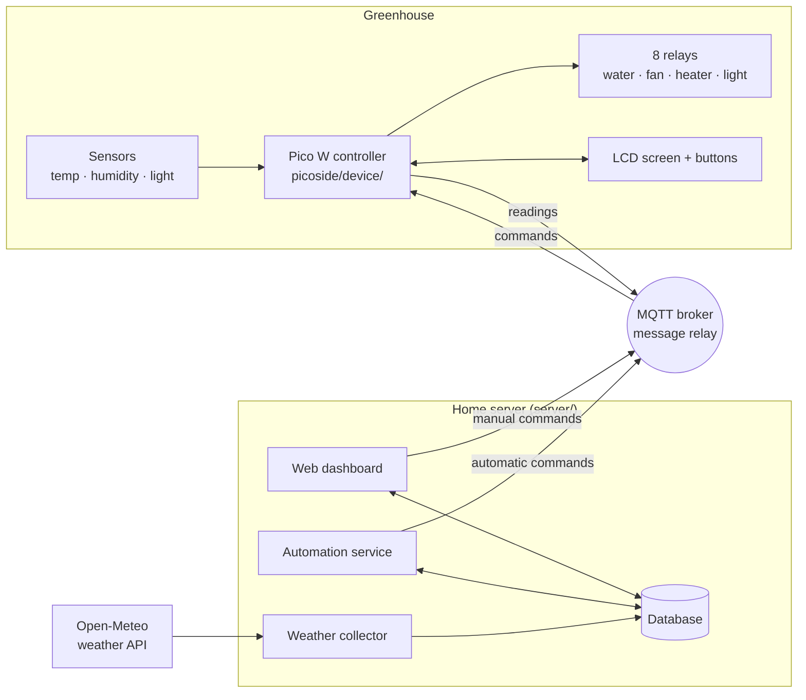

# Greenhouse Control System

A home-built smart greenhouse. A small microcontroller inside the greenhouse measures conditions and
switches equipment. A web dashboard on the home network lets you see what's happening, change the
rules, and switch things by hand.

> **Status (Sept 2026):** everything is built and tested on a computer (800+ automated tests);
> the first run on the real hardware is next. See [What works today](#what-works-today) and the
> [plan](docs/PLAN.md).

## What it does

- **Measures** temperature, humidity and light inside the greenhouse every 5 minutes.
- **Controls** a bank of 8 relays. Four are in use: **water**, **fan**, **heater** and **light**.
  Four are spare.
- **Automates** the equipment from rules you set on the dashboard:
  - turn the fan on above a temperature or humidity level
  - turn the heater on below a temperature
  - water up to four times a day for a set duration
- **Records outdoor weather** for the location every 15 minutes (temperature, humidity, rain, wind,
  sunrise and sunset) from the free Open-Meteo service.
- **Works locally too**: a 4-line screen and five buttons on the device show readings and toggle
  relays without the dashboard.

## Getting started (no coding needed)

You need: a computer that stays on (a Raspberry Pi, or a Windows, Mac or Linux PC), the Pico W
controller board, a USB data cable, and a **2.4 GHz** Wi-Fi network.

1. **Get the files.** On GitHub choose **Code › Download ZIP** and unzip it, or
   `git clone https://github.com/samuelgottipalli/greenhouse.git` (a clone can update itself later).
2. **Run the installer.**
   - Windows: double-click **`setup.bat`**.
   - Mac or Linux: open a terminal in the folder and run **`sh setup.sh`**.

   It installs what it needs and opens a window that walks you through the rest: your town and
   time zone, a dashboard password, the messaging service, starting the server, and finally the
   controller over USB (it installs MicroPython on a new Pico, puts your Wi-Fi details on it and
   waits until it's online).
3. **Open the dashboard** at the address the installer shows (e.g. `http://192.168.1.20:8501`)
   from any phone or computer on your Wi-Fi.

**No USB cable, or changing Wi-Fi later?** Hold the controller's screen button while switching it
on. It starts its own Wi-Fi network (`GreenhouseSetup-…`, password on its screen). Join it with
your phone, scan the QR code from the dashboard's **Settings › Controllers** page, pick your
Wi-Fi and save. A brand-new controller does this by itself.

**Updates.** Run the installer again and choose **Update** (for a `git clone`). When the
controller's code has changed, **Settings › Controllers** shows *Update available*; one button
updates the controller over Wi-Fi, and it goes back to the old version by itself if the new one
doesn't start properly.

The step-by-step manual setup, and the checks for the first run on real hardware, are in
[docs/RUNBOOK.md](docs/RUNBOOK.md).

## How the pieces fit together



- **The controller** (`picoside/device/`) is a Raspberry Pi Pico W running MicroPython. It reads
  the sensors, drives the relays, updates the screen, and talks to the server over Wi-Fi. It gets
  the time from the internet (NTP) and shows it in the time zone chosen during setup.
- **MQTT** is a lightweight messaging system. The controller and the server never talk directly;
  both send messages through an MQTT "broker" on the home network.
- **The home server** (`server/`) runs three things:
  - the **web dashboard** (built with Streamlit)
  - an **automation service** that checks the rules every few seconds and sends commands
  - a **weather collector** that saves outdoor weather every 15 minutes

  All three share one SQLite database file.

## What's in this repository

| Folder | What it is |
|---|---|
| `setup.bat`, `setup.sh`, `installer/` | The installer: a step-by-step window for the server and the controller. |
| `picoside/device/` | Everything that is copied onto the Pico. `main.py` starts at power-on, `controller.py` is the main loop, `provision.py` is the setup hotspot, `ota.py` and `boot.py` handle updates over Wi-Fi, and `lib/` holds third-party drivers. |
| `picoside/setup_config.py` | Run on your computer to create the controller's `config.json` by hand (Wi-Fi, broker, time zone). |
| `server/app.py` | The web dashboard. Its pages are in `server/views/` and the About/Help text is in `server/content/`. |
| `server/services/` | Background services: `ingest.py` (stores device messages), `automation.py`, `weather_collector.py`, `firmware_server.py` (controller code for updates), and `alerts.py` (push/email alerts, every 2 min). |
| `server/run_all.py` | Runs the whole server with one command on Windows and macOS (Linux uses systemd). |
| `server/core/` | Shared code: database access, settings, MQTT, the weather API client, unit conversions. |
| `server/scripts/` | Maintenance: `upgrade_db.py` creates or upgrades the database; `add_device.py` registers another controller; `backup_db.py` makes a safe live backup; `set_password.py`, `bench.py`, `retention.py`, `telemetry_report.py`. |
| `deploy/` | systemd service files and their installer; MQTT broker config. |
| `server/data/` | The SQLite database. |
| `tests/` | Automated tests for both sides (see [Running the tests](#running-the-tests)). |
| `docs/` | [FINDINGS.md](docs/FINDINGS.md) (known problems), [PLAN.md](docs/PLAN.md) (what's next) and [MQTT.md](docs/MQTT.md) (the messages the two sides exchange). |

An older dashboard built with Dash (`serverside/`) was replaced by the Streamlit version and has
been removed. It is still in the git history.

### Dashboard pages

| Page | What you can do |
|---|---|
| **Home** | Health at a glance: controller online/offline with uptime, Wi-Fi signal and memory; how fresh the readings are; each relay's state; and whether the background services are OK. |
| **Reports › Weather Data** | Today's outdoor weather, with small trend charts. |
| **Reports › Greenhouse Weather** | Latest temperature, humidity and light inside the greenhouse, plus 24-hour, 7-day and 30-day history charts. |
| **Control › Remote Control** | Switch the fan, heater, light and water on or off. |
| **Settings › App Settings** | Choose °C or °F, date and time formats, and time zone. |
| **Settings › Greenhouse Settings** | Set the fan, heater and watering rules; revert or restore defaults. |
| **Settings › Controllers** | Connect a controller to Wi-Fi (setup code and QR code) and update its software. |
| **Settings › About / Help** | Background and usage notes. |

### On the device

- **Screen:** shows local time, temperature, humidity, uptime and connection status (`OK`,
  `NoMQTT` or `NoWiFi`). After a relay changes, it shows that relay's status for 10 seconds.
- **Relay buttons 1–4:** toggle water, fan, heater or light. A quick double-press toggles spare
  relays 5–8.
- **Screen button:** cycles through the relay status screens. Hold button 1 and press it to show
  the device's IP address. Hold it while switching on to start the setup hotspot.

## What works today

| Area | Status |
|---|---|
| Device reads sensors, drives relays, runs the screen and buttons | ✅ Works standalone, and recovers from Wi-Fi or broker outages |
| Device clock | ✅ Internet time (NTP) plus the time zone from setup |
| Weather collector saves outdoor weather | ✅ Works when running |
| Dashboard: weather page, settings pages, control toggles | ✅ Mostly works (see findings S-03 to S-09) |
| Server → device: commands move the relays | 🟡 Both sides now agree on the message format; not yet tried on the hardware |
| Device → server: readings, relay changes and online status stored | 🟡 `services/ingest.py` built and tested end to end; not yet tried on the hardware |
| Automation | ✅ Tested rules on the server; the controller runs the same rules itself when the network is down, and cuts the heater if its sensor fails |
| Security | 🟡 Dashboard login and a locked-down broker (the installer sets both up); the old Wi-Fi password was scrubbed from git history but still needs changing (SEC-01) |
| Installer, setup hotspot, updates over Wi-Fi | 🟡 Built and tested on a computer; not yet tried on the hardware |

Details and fixes are in [docs/FINDINGS.md](docs/FINDINGS.md) and [docs/PLAN.md](docs/PLAN.md).

## Running it (quick reference)

The installer does all of this. By hand:

**Server.** From the `server/` folder, with the virtual environment active:

```bash
python -m scripts.upgrade_db             # first time, or after pulling changes (safe to repeat)
python -m scripts.set_password           # set the dashboard login password
streamlit run app.py                     # web dashboard (http://localhost:8501)
python -m services.weather_collector     # weather collector (leave running)
python -m services.automation            # automation service (leave running)
python -m services.ingest                # stores what the Pico sends (leave running)
python -m services.firmware_server       # serves controller updates (leave running)
```

On Windows or macOS, `python run_all.py` runs all of them (and the broker, if the installer set
one up) and restarts any that stop.

On the always-on server (Linux), install them all as services that start at boot and restart
after a crash: `sudo venv/bin/python deploy/install_services.py --user <you> --enable`. Logs:
`journalctl -u greenhouse-ingest -f`. Step-by-step setup is in [docs/RUNBOOK.md](docs/RUNBOOK.md).

`python -m scripts.retention --measure` shows how much the database grows per year with the
nightly retention job (about 2.6 MB per device).

`python -m scripts.bench` times the dashboard's queries on a year of synthetic data (the real
database is not touched).

Settings such as the database location, broker address, time zone and weather location come from
`server/.env`. The database needs SQLite 3.37 or newer.

**Controller.** On your computer:

```bash
python picoside/setup_config.py          # asks for Wi-Fi, broker, device ID and time zone
mpremote cp -r picoside/device/. :       # copy everything in device/ onto the Pico
```

`config.json` (your Wi-Fi password) and `server/.env` (broker login) are git-ignored; only the
`config.example.json` and `.env.example` templates are committed. For a fresh clone, copy
`server/.env.example` to `server/.env` and run the setup script above.

## Running the tests

From the repository root:

```bash
venv/Scripts/python -m pytest        # Windows
venv/bin/python -m pytest            # Linux / macOS
```

Install the test tools with `pip install -r requirements-dev.txt`. The tests use a temporary
database and never touch `greenhouse.db` or a real MQTT broker. The firmware tests run on a normal
computer using stand-ins for the Pico hardware, and every firmware file is also compiled with
MicroPython's own compiler (`mpy-cross`).

Tests marked `known_bug` reproduce problems from the findings and are expected to fail for now.
`pytest -rx` lists them. When a bug is fixed, its test starts passing and pytest flags it, which
is the reminder to remove the marker.
